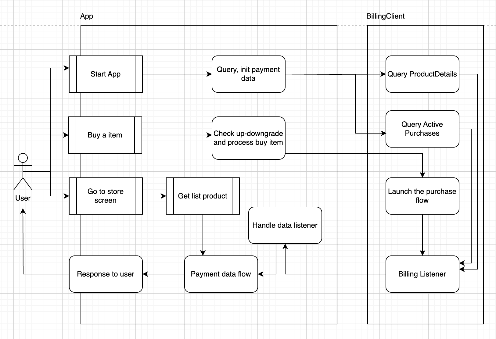
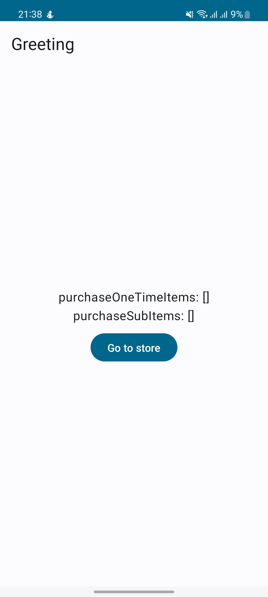
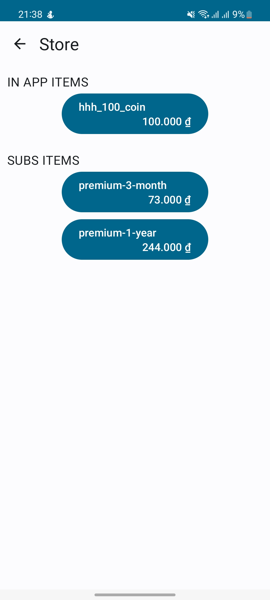
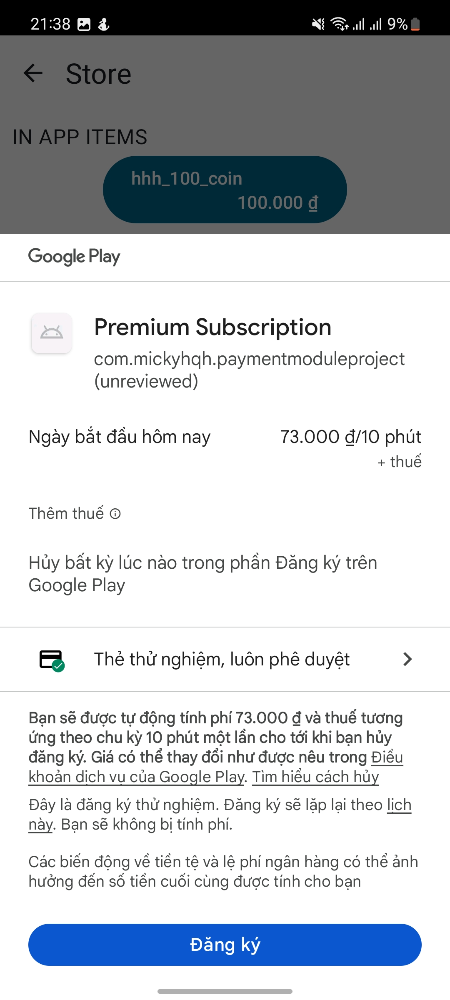

# Google Billing Payment
A Android app to demo how to integrate Google Play Billing (In app purchase, Subscription purchase)

# Specifications
- Android Jetpack Compose
- Google Play Billing: v6.1.0

 &emsp;  &emsp; 

# How to setup
- Step 1: Go to build gradle (app) change applicationId (ex: com.your-name.example)
- Step 2: Build app bundle with signed bundle key
- Step 3: Use Google Play Developer login into Google Play Console. From Google Play Console:
  - Create new Android app
  - Init purchase item: In App (productId: hhh_100_coin),  Subscription (groupId: group_premium, and add some children)
  - Update 1 app bundle build to any testing environment (recommend Internal Testing)
  - Add email tester
- Step 4: Prepare a device with the main email service is the email which you use for tester
- Step 5: Build & run project

# ref
https://developer.android.com/google/play/billing

https://github.com/android/play-billing-samples/tree/master/ClassyTaxiAppKotlin
